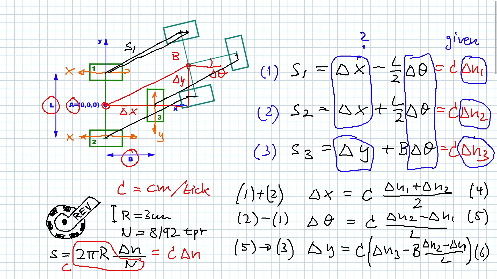
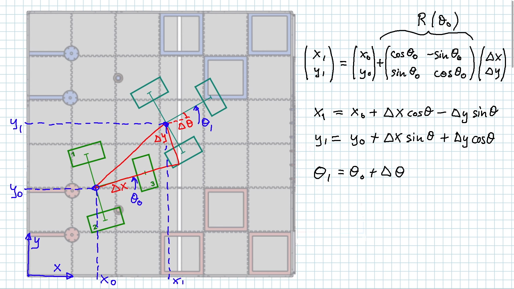

# ROS2 Mecabot
This is a [ROS2 Jazzy](https://docs.ros.org/en/jazzy/index.html) based mecanum drive robot project simulated in [Gazebo Harmonic](https://gazebosim.org/docs/harmonic/getstarted/).

## References
These are references and algorithm explanations used in the project.

### - Odometry
Rotary encoder odometry: 
[Youtube](https://youtu.be/Av9ZMjS--gY?si=f_gCDkorZMCKaEdP)  

### - Mecanum Robot Kinematics
4WD mecanum robot kinematics:
[Youtube](https://youtu.be/gnSW2QpkGXQ?si=ZigLoyJ6pj0cPHlQ)
